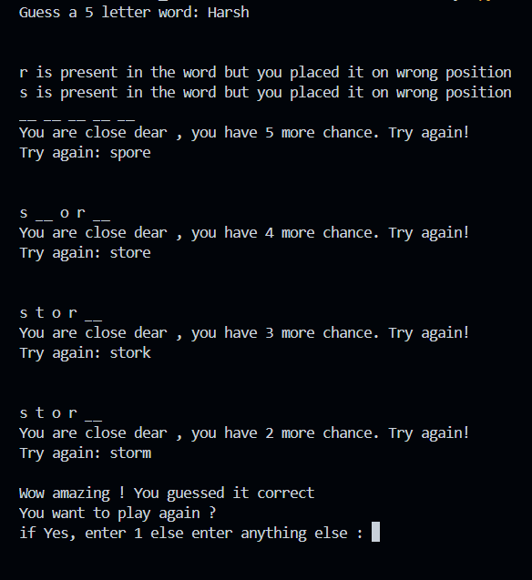

# 🔤 Word Guessor – The 5-Letter Word Challenge in Python 🧠🎯

Welcome to **Word Guessor**, a thrilling word-guessing game built in Python! Test your vocabulary, logic, and intuition as you try to crack a secret 5-letter word in just 6 tries. This game provides real-time feedback on your guesses — and it's all terminal-based!

---

## 🚀 Features

🔢 **Six Strikes and You're Out!**  
You have exactly **6 chances** to guess the correct 5-letter word. Use each guess wisely!

✅ **Instant Feedback on Correct Guesses**  
Guess the word correctly? 🎉 You'll be rewarded with a congratulatory message and the satisfaction of victory.

📍 **Letter Location Hints**  
Made a guess but not quite there? We'll help you out:
- If a letter is **correct and in the right position**, you’ll know it instantly.
- If a letter is in the word **but in the wrong position**, you’ll get a hint like:  
  `"j" is present in the word but you placed it in the wrong position.`

🚫 **No Info? It’s Not There!**  
If you don’t receive any message about a particular letter, that means it's **not present in the word at all**. Simple, subtle, and smart!

📝 **Easily Extendable Word List**  
The program includes a built-in word list where you can **add your own 5-letter words** to make the game more fun and personalized!

## 📸 Demo

---

## 🎮 How to Play

1. Run the script in your terminal or Python environment.
2. Enter a **5-letter English word** each turn.
3. Read the feedback and adjust your next guess.
4. Solve it within 6 attempts — or try again!
